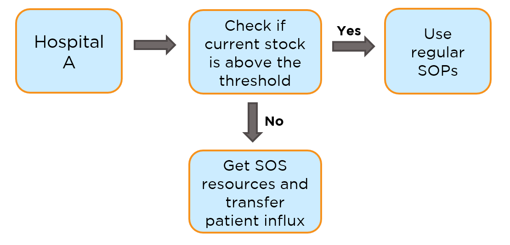

# Hospital Resource Management

We have created a database management system at the hospital level for keeping track of SOS resources and rate of consumption. <br>
If the consumption is high, the hospital admin is notified so that there is enough time to source extra supplies. <br>
In case of severe issues, the influx of patients can be shifted to a partner vacant hospital. <br>

<br>

<kbd><p align="center"> </kbd>
<kbd><p align="center"> </kbd>
  

<br>

  
## Hardware and Software Requirements:
- Server to store the database
- SQL
- Python installation
- Chrome based browser
  

<br>


## Process Flow
  
<p align="center"> <kbd></kbd>


## Code snippet to create a database for a hospital to store details for resource management

```python
cursor.execute('''CREATE TABLE {table}(
                    Patient_id INT,
                    Patient_name VARCHAR(20),
                    Patient_age INT,
                    Patient_dob DATE,
                    Patient_gender VARCHAR(10),
                    address VARCHAR(50),
                    critical_level INT,
                    O2_dosage INT,
                    Remdesivir_dosage INT);
               '''.format(table = HospitalG))
```
<br>

## Code snippet to enter patient details into the database through HTMl website
<p align="center"> <kbd></kbd>
  
  
```python
cmd = ("INSERT INTO [dbo].[{table}] VALUES({patient_id}, '{patient_name}', {patient_age}, 
      '{patient_dob}','{patient_gender}', '{address}',"+ "{criticalness},{O2_dosage},"+
      "{Remdesivir_dosage});").format(table='HospitalG',patient_id = 123,patient_name = 'Ramesh',
      patient_age = 31,patient_dob = '15-aug-90', patient_gender='Male',address = "#123, 
      Second Cross, Hyd",criticalness = 2,O2_dosage = 440,Remdesivir_dosage = 2)
cursor.execute(cmd)
```
<br>

## Code snippet to update patient details
  
  
```python
cursor.execute('''UPDATE [dbo].[{table}] SET {attribute} = {value} WHERE patient_id = {patient_id};
               '''.format(table='HospitalA',attribute = 'patient_age', value=25, patient_id = 16753 ))
```
<br>

## Code snippet to transfer a patient from one hospital to another hospital
<p align="center"> <kbd></kbd>
  
  
```python
cursor.execute('''INSERT INTO [dbo].[{table2}] SELECT * FROM [dbo].[{table1}] WHERE {attribute} = {value}
               '''.format(table1='HospitalG', table2='HospitalH' , attribute='patient_id' , value = 123 ))

cursor.execute('''DELETE FROM [dbo].[{table1}] WHERE {attribute} = {value};
               '''.format(table1='HospitalG',attribute='patient_id',value=123))    
```
<br>

## Code snippet to discharge a patient
<p align="center"><kbd> </kbd>
  
  
```python
cursor.execute('''DELETE FROM [dbo].[{table}] WHERE patient_id = {patient_id};
               '''.format(table='HospitalA',patient_id=35))   
```
<br>

